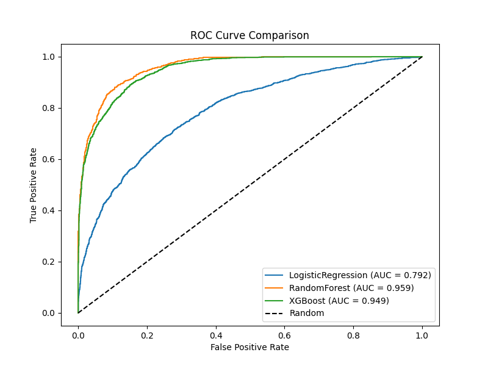
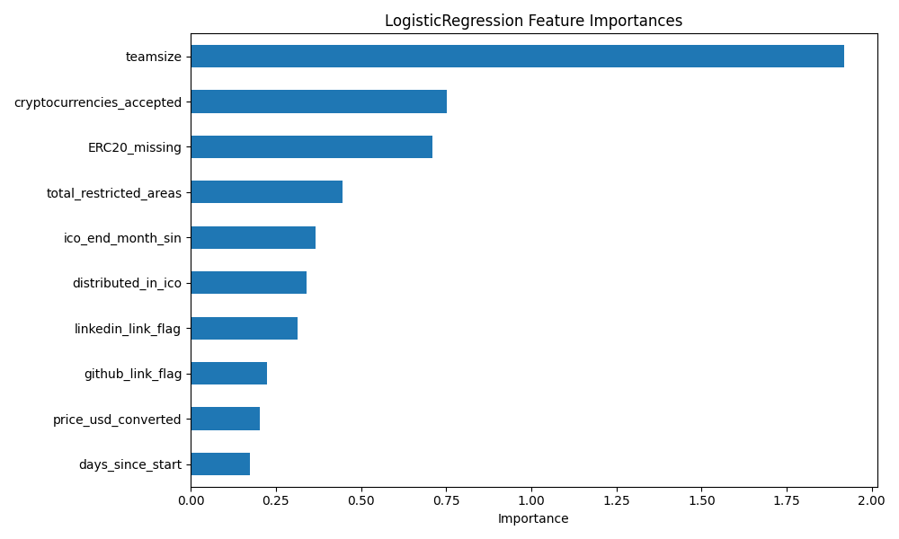

# ICO Success Prediction

## 📌 Project Description

This project aims to predict the success of Initial Coin Offerings (ICOs) using machine learning techniques. It analyzes various factors, including financial data, project features, and social media metrics, to build predictive models that estimate the likelihood of an ICO's success.

---

## 🧠 Models Implemented

The following classification models have been developed and evaluated:

- **Logistic Regression**
- **Random Forest**
- **XGBoost**

Each model has been evaluated using metrics such as ROC curve, PR curve, and feature importance, with results included in the repository.

---

## 📂 Repository Structure

- `Data_202425.csv`: Main dataset used for Cleaning and Featuring.
- `cleaning_featuring.ipynb`: Jupyter notebook for data cleaning and feature engineering.
- `df_model.xlsx`: Excel file with data ready for the pipeline(imputation,model training, evaluation)
- `LogisticRegression_*`: Files related to the Logistic Regression model.
- `RandomForest_*`: Files related to the Random Forest model.
- `XGBoost_*`: Files related to the XGBoost model.
- `*.png`: Visualizations generated to display results and metrics.
- `model_results.csv`: CSV file containing model evaluation outputs, metrics, and results.

---

## 🛠️ Requirements

Install the following Python libraries to run the project:

- `pandas`
- `numpy`
- `scikit-learn`
- `xgboost`
- `matplotlib`
- `seaborn`

You can install dependencies by running:

```bash
pip install -r requirements.txt
```

---

## 🚀 How to Use

1. Clone the repository:

   ```bash
   git clone https://github.com/kenjihilasak/ICO_success_prediction.git
   ```

2. Navigate to the project directory:

   ```bash
   cd ICO_success_prediction
   ```

3. Run the main script to train and evaluate models:

   ```bash
   python runModel.py
   ```

Make sure that `runModel.py` includes the full pipeline for data loading, model training, and evaluation.

---

## 📊 Results

The random forest model demonstrates a strong ability to predict the success of ICOs. Below are some key visualizations:






---

## 🤝 Contributing

Contributions are welcome! Please follow these steps:

1. Fork the repository.
2. Create a new branch (`git checkout -b feature/new-feature`).
3. Make your changes and commit (`git commit -am 'Add new feature'`).
4. Push your changes (`git push origin feature/new-feature`).
5. Open a Pull Request.

---

## 📬 Contact

For questions or suggestions, feel free to contact me at https://www.linkedin.com/in/kenjihilasak/.

